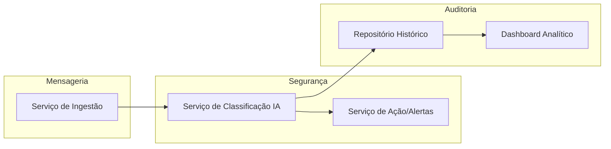
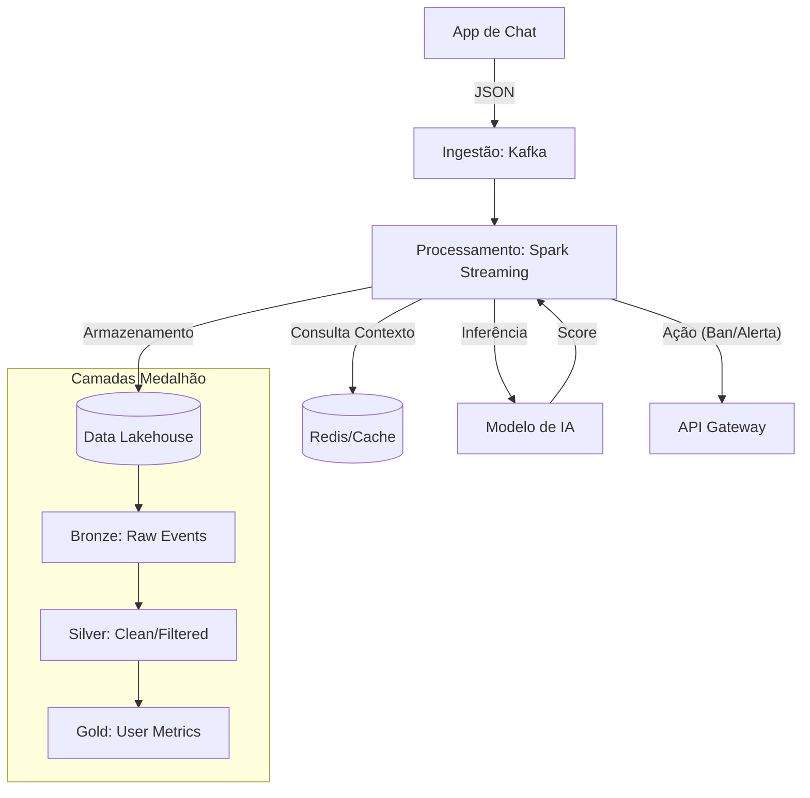

# algum nome
Este projeto constitui a 1ª avaliação da disciplina de Engenharia de Dados. O objetivo é planejar um ciclo de vida de dados capaz de processar, analisar e armazenar fluxos de mensagens de chat para identificar comportamentos abusivos utilizando IA.

---

## 1. Descrição do Projeto (4.1)
* **Nome do Projeto:** n sei
* **Contexto de Negócio:** Plataformas de comunicação em tempo real (ex: Discord, Twitch, chats de jogos) que exigem ambientes seguros e livres de toxicidade.
* **Problema:** A moderação manual é lenta e inescalável e projetos de moderação automática não utilizam contexto. O projeto resolve a necessidade de processar milhares de eventos por segundo, aplicando inteligência contextual com baixa latência.
* **Stakeholders:** Equipes de *Trust & Safety*, moderadores de comunidade e usuários finais.

---

## 2. Definição e Classificação dos Dados (4.2)

### 2.1. Dados de Streaming (Eventos)
* **Fonte:** Logs de mensagens do aplicativo de chat.
* **Formato:** JSON.
* **Periodicidade:** Tempo real (Streaming).
* **Volume Estimado:** 5.000 a 10.000 mensagens/segundo.
* **Latência Esperada:** < 500ms.

### 2.2. Dados Operacionais (Batch/Históricos)
* **Fonte:** Banco de dados de usuários e tabelas de configuração.
* **Formato:** Estruturado (PostgreSQL).
* **Frequência:** Carga diária ou sob demanda.
* **Conteúdo:** Blacklists de usuários, dicionários de termos por contexto e logs de punições.

---

## 3. Domínios e Serviços (4.3)

O sistema é dividido em três domínios principais:
1. **Domínio de Mensageria:** Focado na ingestão e transporte confiável do dado bruto.
2. **Domínio de Segurança:** Onde ocorre a classificação por IA e a execução de ações (banimentos).
3. **Domínio de Auditoria:** Responsável pela persistência de longo prazo e análise de métricas.

### Diagrama de Domínios

## 4\. Arquitetura e Fluxo de Dados (4.4)

Optamos pela **Arquitetura Kappa**, pois o chat é um fluxo contínuo onde o processamento em tempo real é a prioridade absoluta. O armazenamento segue o padrão **Lakehouse (Medalhão)**.

### Fluxo Ponta a Ponta

* Justificativa: Diferente da arquitetura Lambda, que exige manter duas bases de código separadas (batch e streaming), a Kappa permite tratar o histórico como um stream de dados antigo. Se precisar recalcular o score de toxicidade de um usuário, basta 'resetar' o ponteiro do Kafka e reprocessar os eventos através do mesmo código do Spark

* Trade-offs: 
    *  Escalabilidade: Alta via particionamento do Kafka.

    * Disponibilidade: Garantida pela resiliência do cluster Spark.

    * Reversibilidade: Decisões de banimento podem ser revistas via logs na camada Silver.

## 5. Tecnologias Escolhidas (4.5)

| Etapa          | Tecnologia             | Justificativa |
|---------------|------------------------|--------------|
| Ingestão      | Apache Kafka           | Padrão de mercado para alta vazão e persistência temporária de streams |
| Armazenamento | PostgreSQL + MinIO     | PostgreSQL para dados relacionais e MinIO (compatível com S3) para o Data Lake local |
| Processamento | PySpark                | Facilidade de integração com modelos de IA em Python e processamento distribuído |
| Orquestração  | Apache Airflow         | Gerenciamento de pipelines de limpeza e retreinamento de modelos |
| Consumo       | Metabase + FastAPI     | Metabase para visualização de dados e FastAPI para interface de ação com o chat |
| Segurança/Ops | Docker                 | Garantia de ambiente reprodutível para a Parte 2 do projeto |

## 6\. Considerações Finais (4.6)

##  **Riscos:** Latência de rede entre o Spark e o serviço de IA.
        
    -   **Limitações:** O protótipo inicial usará dados simulados para não ferir a privacidade de usuários reais.
        

