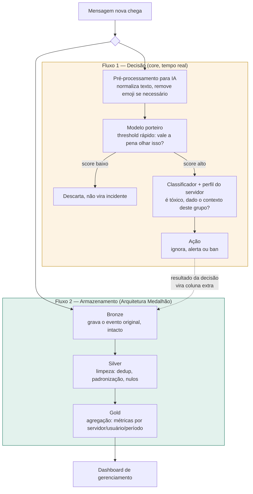
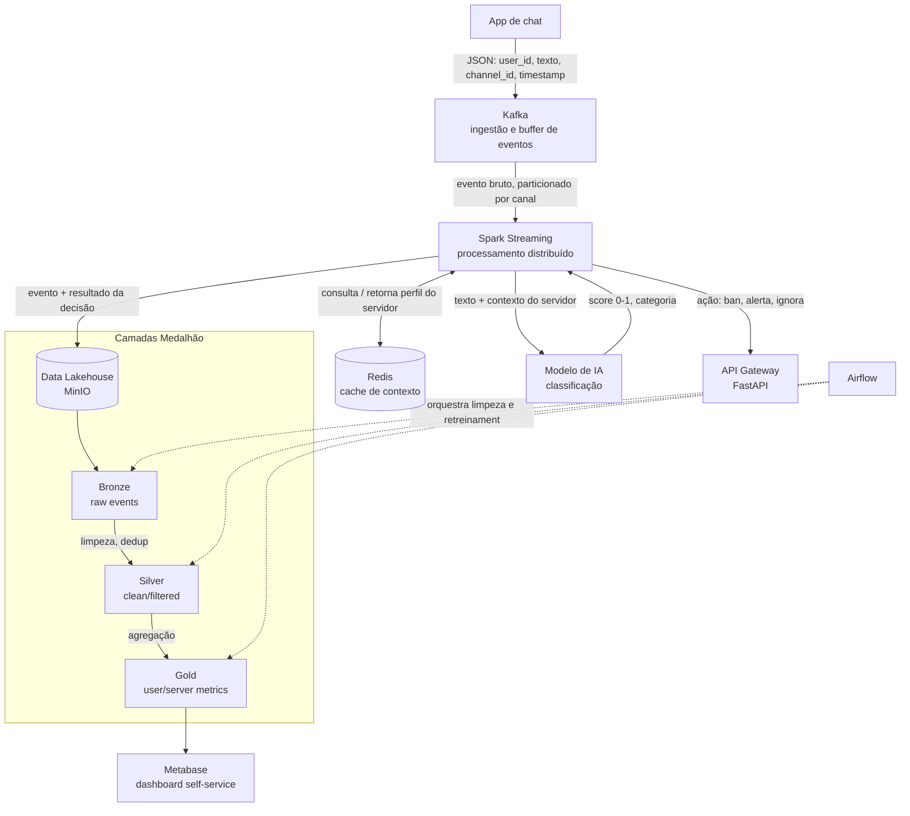
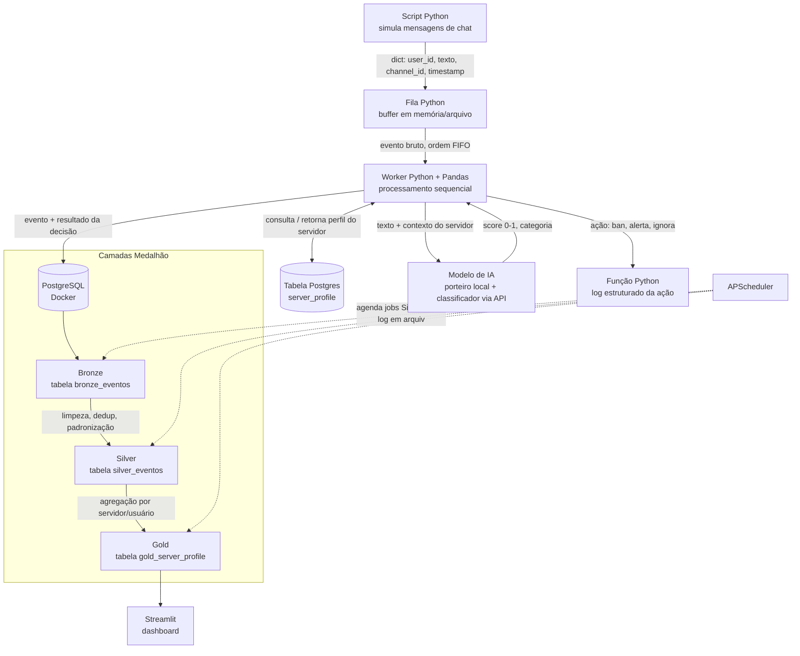

# Sentinel.AI — Pipeline de Moderação de Conteúdo em Tempo Real

Projeto da disciplina de Engenharia de Dados. Implementa um ciclo de vida de dados capaz de processar, analisar e armazenar fluxos de mensagens de chat para identificar comportamentos abusivos com inteligência contextual, ou seja, capaz de diferenciar vocabulário comum de um grupo de uma ofensa real, em vez de aplicar apenas uma blacklist fixa de palavras.

Este README documenta tanto a **arquitetura** (proposta na 1ª avaliação, pensada para produção em escala) quanto a **arquitetura as-built** (efetivamente implementada neste MVP), e justifica tecnicamente cada substituição feita.

---

## 1. Descrição do projeto

* **Contexto de negócio:** plataformas de comunicação em tempo real (Discord, Twitch, chats de jogos) que precisam de moderação escalável e sensível ao contexto de cada comunidade.
* **Problema:** moderação manual é lenta e inescalável; moderação automática tradicional (blacklist fixa) ignora contexto — a mesma expressão pode ser ofensiva em um grupo e corriqueira em outro.
* **Stakeholders:** equipes de Trust & Safety, moderadores de comunidade, usuários finais.

---

## 2. Importante: este é um MVP de validação de arquitetura

A arquitetura original (1ª avaliação) foi desenhada para um cenário de produção real, com volume de 5.000–10.000 mensagens/segundo, usando Kafka, Spark Streaming, MinIO e Airflow. Para esta entrega, as ferramentas de infraestrutura pesada foram **substituídas por equivalentes funcionais mais leves**, com o objetivo de validar a lógica do pipeline ponta a ponta dentro do prazo e dos recursos computacionais disponíveis (desenvolvimento solo, máquina local via WSL/Docker).

Cada substituição preserva o **papel arquitetural** da ferramenta original. o que muda é a tecnologia que cumpre esse papel, não o papel em si. A tabela da seção 6 detalha essa correspondência.

Essa decisão está alinhada ao próprio objetivo da Arquitetura Kappa adotada: o pipeline trata histórico como replay de eventos, então a lógica de negócio (decisão de moderação, camadas do Medalhão) é a mesma independentemente de qual motor de processamento ou de mensageria está por baixo. Trocar Kafka por uma fila Python ou Spark por Pandas não muda *o que* o sistema decide — muda apenas a capacidade de escala da implementação.

---

## 3. Os dois fluxos do pipeline

A confusão mais comum ao ler este pipeline é tratar a moderação por IA como parte das camadas Bronze/Silver/Gold. Não é. O sistema tem **dois fluxos paralelos com propósitos diferentes**, que se cruzam em um único ponto.

* **Fluxo de decisão (o core do projeto):** responde "essa mensagem, agora, neste grupo, é tóxica?". Roda em tempo real, mensagem por mensagem, e morre depois de gerar uma ação.
* **Fluxo de armazenamento (Arquitetura Medalhão):** responde "o que aconteceu até agora?". Acumula histórico para sempre, alimenta auditoria e dashboards. Não decide nada — apenas registra e agrega decisões que o fluxo de decisão já tomou.

O ponto de cruzamento: o resultado do fluxo de decisão (score de toxicidade, categoria, ação tomada) é anexado ao registro da mensagem **antes** desse registro ser gravado na camada Bronze. Ou seja, a IA decide primeiro; o que ela decidiu vira só mais uma coluna do dado que é armazenado.



**Em uma frase cada:** o Fluxo 1 decide e morre; o Fluxo 2 acumula e nunca decide. Se o Fluxo 2 fosse desligado, a moderação continuaria funcionando — perderíamos apenas histórico, auditoria e dashboard. O inverso não é verdade: sem o Fluxo 1, o Fluxo 2 não teria nada relevante para guardar.

---

## 4. Arquitetura (proposta na 1ª avaliação)

Pensada para o cenário de produção real, com Arquitetura Kappa e armazenamento em padrão Lakehouse/Medalhão.



**Justificativa da Arquitetura Kappa:** diferente da Lambda, que exige manter duas bases de código separadas para batch e streaming, a Kappa trata o histórico como um stream antigo. Para recalcular o score de toxicidade de um usuário, basta reprocessar os eventos do mesmo ponto do Kafka através do mesmo código do Spark.

**Trade-offs:**
- Escalabilidade: alta, via particionamento do Kafka.
- Disponibilidade: garantida pela resiliência do cluster Spark.
- Reversibilidade: decisões de banimento podem ser revistas via logs na camada Silver.

---

## 5. Arquitetura as-built (efetivamente implementada no MVP)

Mesma lógica, mesmos dois fluxos, mesmas camadas Medalhão — implementados com ferramentas leves o suficiente para rodar em uma máquina local solo, sem cluster.



---

## 6. Tabela de correspondência: visionário → as-built

| Papel arquitetural | Arquitetura | Arquitetura as-built (MVP) | Justificativa da troca |
|---|---|---|---|
| Ingestão / mensageria | Apache Kafka | Script Python + fila em memória | Kafka exige cluster com Zookeeper; volume do protótipo (mensagens simuladas) não justifica a complexidade operacional. A fila Python preserva o papel de buffer e ordenação FIFO. |
| Cache de contexto | Redis | Tabela PostgreSQL (`server_profile`) | Sem necessidade de latência sub-milissegundo em ambiente de validação; consulta SQL local é suficiente e elimina um serviço adicional no Docker. |
| Processamento | PySpark / Spark Streaming | Python + Pandas | Processamento distribuído não traz benefício em volume de protótipo single-node; Pandas elimina a necessidade de cluster Spark e de UDFs registradas, mantendo a mesma lógica de transformação aplicada linha a linha. |
| Armazenamento / Data Lake | PostgreSQL + MinIO (S3-like) | PostgreSQL apenas (tabelas Bronze/Silver/Gold) | Um único serviço gerenciado em vez de dois; o papel do Medalhão (granularidade crescente do dado) é preservado em tabelas relacionais. |
| Orquestração | Apache Airflow | APScheduler (biblioteca Python) | Airflow exige scheduler, webserver e metastore próprios. APScheduler cumpre o mesmo papel de agendamento e encadeamento de tarefas, com evidência via log de execução. |
| Ação / interface com o chat | FastAPI | Função Python com log estruturado | Sem chat real conectado neste MVP; a função simula a chamada de ação (ban/alerta) e registra o resultado, mantendo o contrato de dados idêntico ao que uma API real receberia. |
| Consumo / dashboard | Metabase | Streamlit | Streamlit não exige configuração de servidor adicional e permite construir o dashboard em Python no mesmo repositório, sem perder a função de "Gold pronto para uso". |
| Ambiente reprodutível | Docker (múltiplos serviços) | Docker (apenas PostgreSQL) | Reduz de 7+ containers inter-dependentes para 1, eliminando a maior fonte de risco de configuração em ambiente solo com primeiro uso de Docker. |

**O que não mudou:** Arquitetura Kappa, padrão Medalhão (Bronze/Silver/Gold), separação entre fluxo de decisão e fluxo de armazenamento, e o contrato de dados entre etapas (os mesmos campos trafegam, apenas com tecnologia diferente movendo-os).

---

## 7. Modelo de IA — abordagem de contexto

O modelo de IA não tenta resolver moderação contextual com um classificador único e genérico. A abordagem é em cascata:

1. **Modelo porteiro:** threshold rápido e local (ex.: pontuação ponderada por vocabulário) que decide se a mensagem merece análise mais profunda. Baixo custo, roda em toda mensagem.
2. **Classificador com contexto:** só roda nas mensagens que passaram do porteiro. Consulta o perfil do servidor (`server_profile`) — vocabulário típico daquele grupo, nível geral de toxicidade, padrões de conflito conhecidos — antes de decidir.
3. **Perfil de servidor:** construído e atualizado periodicamente (não a cada mensagem) a partir de um scan das mensagens do grupo, evitando enviar histórico completo a cada inferência.

Essa cascata é o que permite diferenciar, por exemplo, uma expressão informal comum em um grupo de jogos de uma ofensa real em escalada de conflito, sem o custo de rodar um modelo pesado em 100% do tráfego.

---

## 8. Estrutura do repositório

```
sentinel-ai/
├── README.md
├── docker-compose.yml          # PostgreSQL
├── requirements.txt
├── src/
│   ├── ingestion/               # simulação de mensagens + fila
│   ├── decision/                # modelo porteiro + classificador + ação
│   ├── pipeline/                # bronze, silver, gold
│   ├── orchestration/           # jobs do APScheduler
│   └── dashboard/                # app Streamlit
├── sql/
│   └── schema.sql               # criação das tabelas
└── logs/
    └── orquestracao.log
```

---

## 9. Como executar

```bash
# 1. Subir o PostgreSQL
docker compose up -d

# 2. Instalar dependências
pip install -r requirements.txt

# 3. Rodar a ingestão + orquestração (background)
python src/orchestration/main.py

# 4. Abrir o dashboard
streamlit run src/dashboard/app.py
```

---

## 10. Riscos, limitações e próximos passos

* **Riscos:** latência adicionada pela chamada a uma LLM externa no classificador, caso esse seja o modelo escolhido para o nível de contexto mais profundo.
* **Limitações:** dados simulados, sem conexão a um chat real, para não expor dados de usuários reais. Processamento sequencial (Pandas) não reflete o throughput exigido em produção (5.000–10.000 msg/s).
* **Próximos passos:** avaliação comparativa de modelos para o classificador de contexto; teste de carga para identificar em que volume a migração para Spark/Kafka se torna necessária; implementação do loop de feedback humano para retreinamento do perfil de servidor.

---

## 11. Referências

* KREPS, Jay. *Questioning the Lambda Architecture*. O'Reilly, 2014.
* Databricks. *What is the Medallion Lakehouse Architecture?* Documentação oficial.
* Documentação oficial: Apache Kafka, Apache Spark, Apache Airflow, PostgreSQL, APScheduler, Streamlit.
